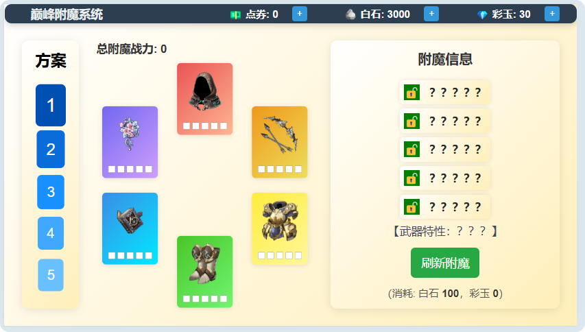
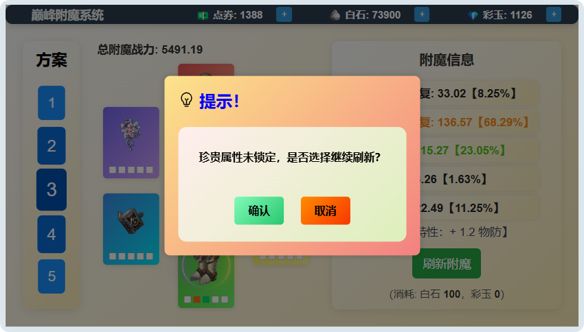
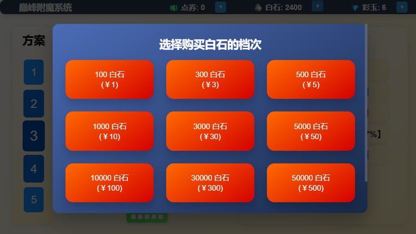
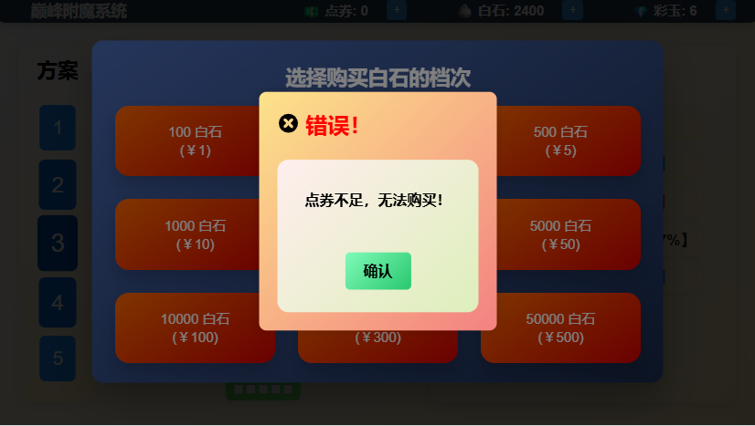
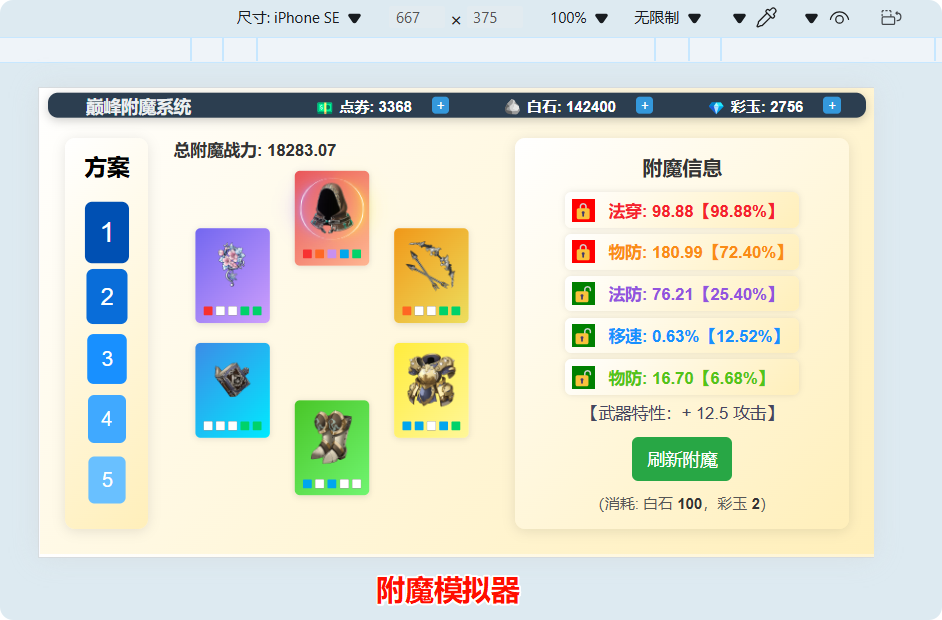
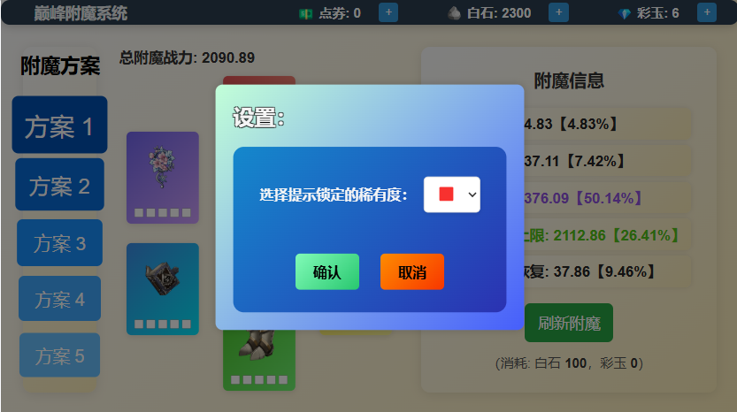
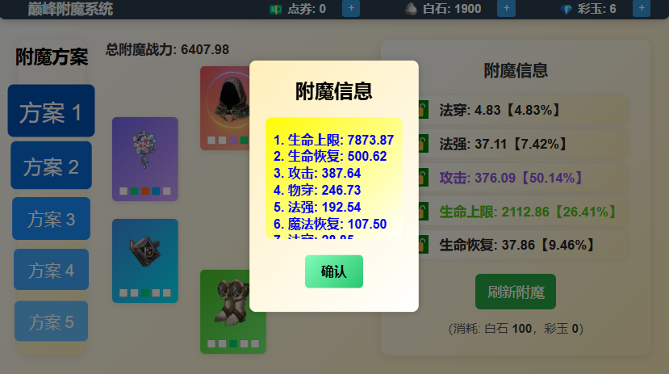

# Enchantment-System
 附魔战力系统

## 使用方法

点击Release的“default.html”文件，另存为本地，打开即可运行。

## UI展示

### 初始界面

### 未锁定红/橙品质词条【可选】

### 购买资源界面

### 点券不足界面

### 附魔展示

### 其他功能

增加了选择提示锁定稀有度词条的功能【点击左上角的巅峰附魔系统】

增加了当前方案的词条信息统计【点击词条上方的“附魔信息”】

### 待办功能

【✔】更多的附魔词条（百分比类型）

【✔】刷新后概率增加武器属性

【❌】更准确的附魔战力

### 参考资料

- Chat-GPT
- [SegmentFault 思否](https://segmentfault.com/)
